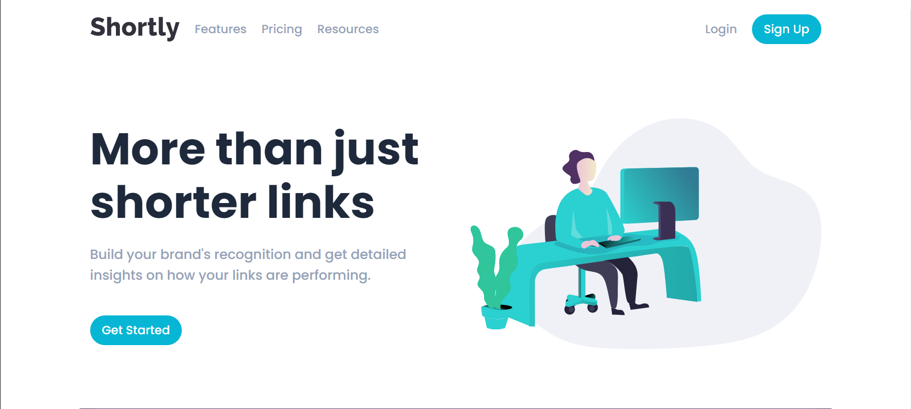
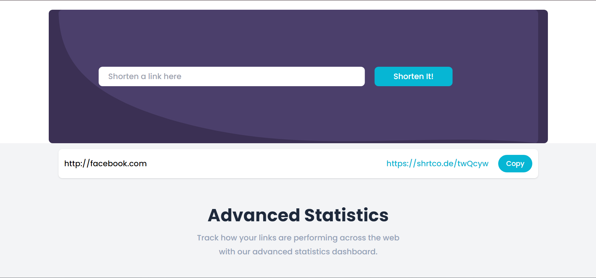
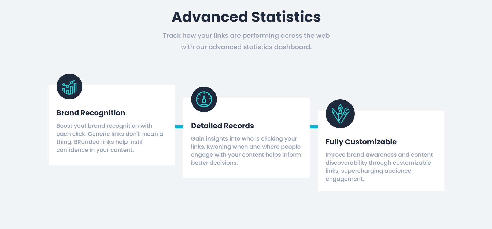
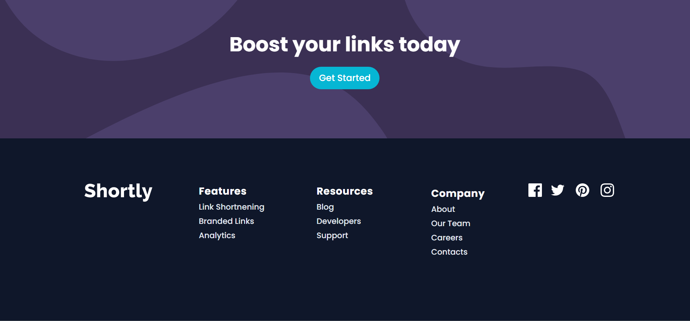

# Frontend Mentor - Shortly URL shortening API Challenge solution

This is a solution to the [Shortly URL shortening API Challenge challenge on Frontend Mentor](https://www.frontendmentor.io/challenges/url-shortening-api-landing-page-2ce3ob-G).

## Contents

- [Overview](#overview)
  - [What it can do](#what-it-can-do)
  - [Screenshot](#screenshot)
- [My process](#my-process)
  - [Built with](#built-with)
  - [Available Scripts](#available-scripts)
- [Author](#author)

### What it can do

- View the optimal layout for the site in all device's size.
- Shorten any valid URL
- See the last shortened link, even after refreshing the browser.
- Copy the shortened link to their clipboard in a single click
- Receive an error message when the `form` is submitted if:
  - The `input` field is empty

### Screenshot









## My process

### Built with

- https://api.shrtco.de/v2 - API
- [React](https://reactjs.org/)
- [Tailwind](https://tailwindcss.com) - For styles

## Available Scripts

### Clone

```bash
   https://github.com/Fleemings/findWork.git
```

### Install dependencies

```bash
   `npm install`
```

### Start project

```bash
   `npm start`
```

Runs the app in the development mode.\
Open [http://localhost:3000](http://localhost:3000) to view it in your browser.

## Author

- Website - [Milena Fleming](http://www.fleemings.pt)
- Frontend Mentor - (https://www.frontendmentor.io)
